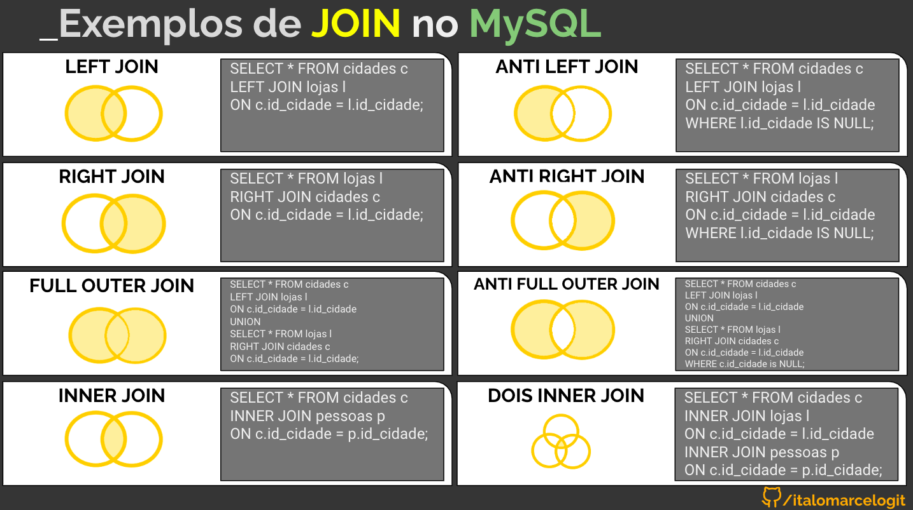

## Para testar
- Execute o docker composer
    - docker-compose up -d     
- Abra o seu navegador
    - url http://localhost:8081
    - login root
    - senha teste
- phpMyAdmin
    - Acesse o database meuDB, clicando no menu do lado esquerdo
    - visualize os dados nas tabelas cidades, lojas e pessoas
    - execute os SQLs dos JOINS demonstrados.